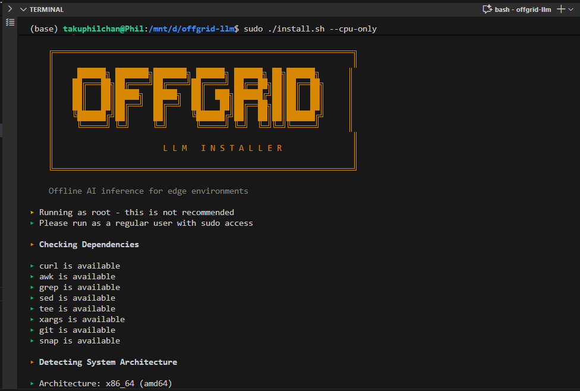
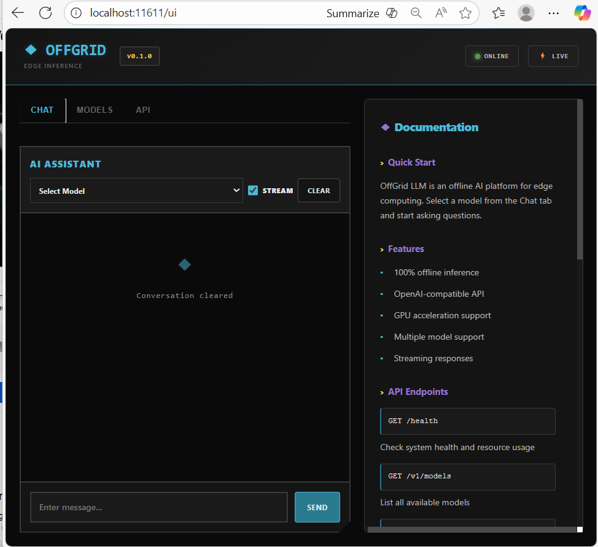
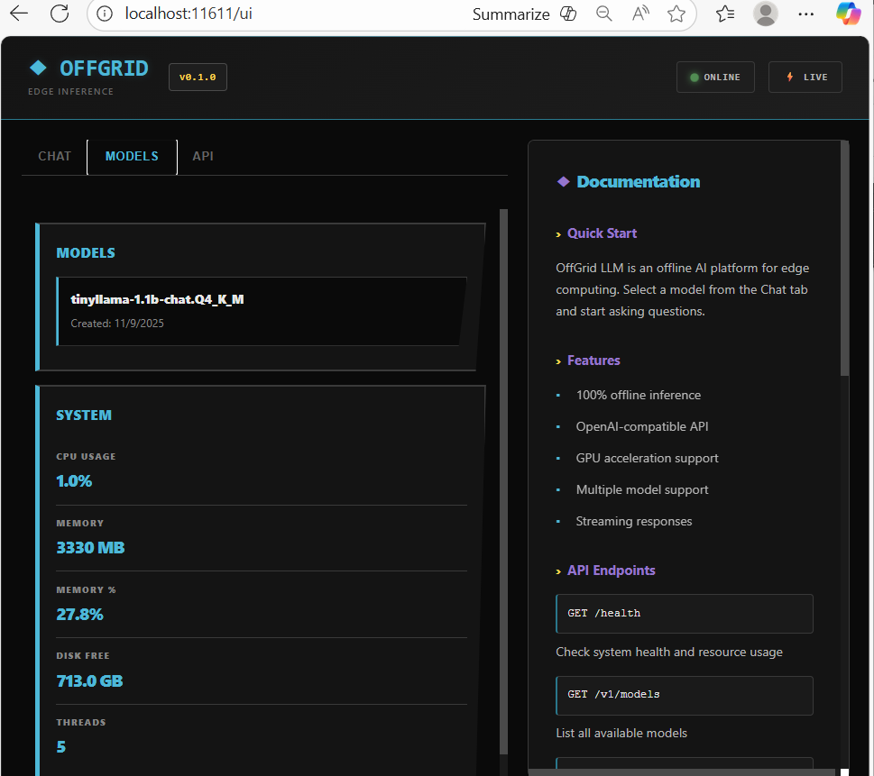

# OffGrid LLM

> **Offline-First AI for Edge Environments**

OffGrid LLM is a production-ready, self-contained LLM orchestrator designed for environments with limited or no internet connectivity. Deploy powerful language models on edge devices, ships, remote clinics, factories, and air-gapped networks.

Built with Go and powered by [llama.cpp](https://github.com/ggerganov/llama.cpp), OffGrid provides an OpenAI-compatible API with GPU acceleration support.

## Screenshots

### Installation Banner

*Industrial ASCII art banner with muted amber color scheme*

### Chat Interface

*Industrial-themed chat interface with real-time streaming and model selection*

### Models & System Info

*Model management and live system resource monitoring*

## Why OffGrid LLM?

Traditional LLM deployments require constant internet connectivity, cloud APIs, and significant bandwidth. OffGrid LLM eliminates these dependencies:

- **True Offline Operation** - Works completely disconnected from the internet
- **GPU Acceleration** - NVIDIA CUDA and AMD ROCm support for fast inference
- **CPU-Only Mode** - Optional CPU-only installation for environments without GPU
- **Resource Efficient** - Runs on devices with as little as 2GB RAM
- **P2P Model Sharing** - Share models across local networks without internet
- **USB Distribution** - Install models from USB drives and SD cards
- **OpenAI Compatible** - Drop-in replacement for OpenAI API
- **Industrial Web UI** - Masculine, brutalist design with fixed layout and documentation sidebar
- **Production Ready** - Systemd services, security hardening, monitoring

## Quick Start

### System Requirements

**Minimum:**
- CPU: 2 cores
- RAM: 2GB (for small models with Q4 quantization)
- Disk: 2GB free space
- OS: Ubuntu 20.04+, Debian 11+, or compatible Linux

**Recommended:**
- CPU: 4+ cores
- RAM: 8GB+
- GPU: NVIDIA GPU with CUDA 12.0+ (for acceleration)
- Disk: 10GB+ free space

### Installation

**Automatic Installation (Recommended)**

```bash
# Clone the repository
git clone https://github.com/takuphilchan/offgrid-llm.git
cd offgrid-llm

# Auto-detect GPU and install (detects NVIDIA/AMD GPU automatically)
sudo ./install.sh

# OR: Force CPU-only mode (no GPU, smaller dependencies)
sudo ./install.sh --cpu-only

# OR: Require GPU mode (fails if no GPU detected)
sudo ./install.sh --gpu

# Show all installation options
./install.sh --help
```

**Installation Options:**

- **`./install.sh`** - Auto-detect GPU hardware and build accordingly (default)
- **`./install.sh --cpu-only`** - Force CPU-only mode, skip GPU detection and CUDA build
- **`./install.sh --gpu`** - Require GPU support, fail if no GPU is detected
- **`./install.sh --help`** - Show usage information and available options

The installer will:
- ✅ Detect NVIDIA/AMD GPU and install acceleration support (or skip with `--cpu-only`)
- ✅ Download and build llama.cpp with optimal configuration
- ✅ Build OffGrid LLM with real inference engine
- ✅ Create systemd services for automatic startup
- ✅ Configure security (localhost-only, random ports)
- ✅ Set up model directory at `/var/lib/offgrid/models`

**Quick Reinstall**

```bash
# Clean install with auto-detect GPU (default)
sudo ./reinstall.sh

# Clean install with CPU-only mode
sudo ./reinstall.sh --cpu-only

# Clean install requiring GPU
sudo ./reinstall.sh --gpu
```

**Manual Build (Development)**

```bash
# Build locally without installing
make build

# Run from directory
./offgrid serve
```

### Post-Installation

After installation, services start automatically:

```bash
# Check service status
sudo systemctl status offgrid-llm
sudo systemctl status llama-server

# View logs
sudo journalctl -u offgrid-llm -f
sudo journalctl -u llama-server -f

# Access web UI
open http://localhost:11611/ui
```

### Your First Model

```bash
# Download TinyLlama (best for testing - 638MB, requires 2GB RAM)
wget https://huggingface.co/TheBloke/TinyLlama-1.1B-Chat-v1.0-GGUF/resolve/main/tinyllama-1.1b-chat-v1.0.Q4_K_M.gguf
sudo mv tinyllama-1.1b-chat-v1.0.Q4_K_M.gguf /var/lib/offgrid/models/
sudo chown offgrid:offgrid /var/lib/offgrid/models/*.gguf

# Restart llama-server to load the model
sudo systemctl restart llama-server

# Verify it's working
curl http://localhost:11611/health
```

**Available via Web UI:**
Visit `http://localhost:11611/ui` to download and manage models through the browser.

### Test the API

```bash
# Check health and system status
curl http://localhost:11611/health

# List available models
curl http://localhost:11611/v1/models

# Chat completion (non-streaming)
curl http://localhost:11611/v1/chat/completions \
  -H "Content-Type: application/json" \
  -d '{
    "model": "tinyllama-1.1b-chat.Q4_K_M",
    "messages": [{"role": "user", "content": "Explain quantum computing"}],
    "stream": false
  }'

# Streaming chat (real-time response)
curl -N http://localhost:11611/v1/chat/completions \
  -H "Content-Type: application/json" \
  -d '{
    "model": "tinyllama-1.1b-chat.Q4_K_M",
    "messages": [{"role": "user", "content": "Write a haiku about AI"}],
    "stream": true
  }'
```

## Architecture

OffGrid LLM uses a two-process architecture for security and stability:

```
┌─────────────────────────────────────────────────────────────┐
│  Client Browser / API Calls                                 │
└───────────────────┬─────────────────────────────────────────┘
                    │ HTTP :11611
                    │ (localhost only)
┌───────────────────▼─────────────────────────────────────────┐
│  OffGrid LLM (Go)                                           │
│  - Request routing & validation                             │
│  - Model management                                         │
│  - Statistics & monitoring                                  │
│  - Web UI serving                                           │
└───────────────────┬─────────────────────────────────────────┘
                    │ HTTP (random port 49152-65535)
                    │ (localhost only)
┌───────────────────▼─────────────────────────────────────────┐
│  llama-server (C++)                                         │
│  - llama.cpp inference engine                               │
│  - GPU acceleration (CUDA/ROCm)                             │
│  - Model loading & caching                                  │
│  - Token generation                                         │
└─────────────────────────────────────────────────────────────┘
```

**Security Features:**
- Both services bind to `127.0.0.1` only (no external access)
- llama-server uses random high port (49152-65535)
- IPAddressDeny/IPAddressAllow in systemd units
- Dedicated `offgrid` user with minimal permissions
- Models stored in `/var/lib/offgrid/models` with proper ownership

## Features

### Core Capabilities

**Real Inference Engine**
- Powered by llama.cpp - battle-tested C++ inference
- GPU acceleration via CUDA (NVIDIA) and ROCm (AMD)
- Automatic GPU detection and configuration
- CPU fallback for systems without GPU
- Optimized for edge hardware

**Offline-First Design**
- Fully functional without internet connectivity
- All inference happens locally on your hardware
- No data sent to external servers
- Models can be pre-loaded from USB/SD cards

**Model Management**
- Simple file-based model loading
- Support for GGUF format (llama.cpp compatible)
- Automatic model detection in `/var/lib/offgrid/models`
- Hot-reload support (restart service to load new models)
- SHA256 verification for downloaded models

**OpenAI-Compatible API**
- `/v1/chat/completions` - Chat interface with conversation history
- `/v1/completions` - Direct text completion
- `/v1/models` - List available models
- `/health` - System diagnostics with GPU info, RAM usage, uptime
- Server-Sent Events (SSE) streaming support
- Compatible with OpenAI client libraries

**Web Dashboard**
- Modern, minimalistic interface with clean white theme
- Interactive chat with streaming responses
- Real-time system monitoring (CPU, RAM, GPU)
- Model information and management
- API testing tools built-in
- Fully functional offline (no CDN dependencies)

**GPU Acceleration**
- Automatic NVIDIA GPU detection (nvidia-smi)
- CUDA 12.x support with automatic path detection
- GPU layer offloading (--n-gpu-layers)
- Fallback to CPU if GPU unavailable
- Real-time GPU utilization monitoring

**Production Ready**
- Systemd service management
- Automatic startup on boot
- Graceful shutdown handling
- Process monitoring and restart
- Structured logging via journald
- Health check endpoint for monitoring

### Advanced Features

**Quantization Support**
- Q2_K through Q8_0 quantization levels
- Automatic detection from model filename
- Quality vs size tradeoffs documented
- Smart recommendations based on available RAM

**Security Hardening**
- Localhost-only binding (127.0.0.1)
- Random high ports for internal communication
- Systemd security directives (IPAddressDeny, etc.)
- Dedicated non-privileged user (`offgrid`)
- No external network access required

**Installation Resilience**
- Automatic GPU detection (nvidia-smi, lspci, /proc/driver/nvidia)
- CUDA toolkit detection in multiple locations
- Fallback ZIP download if git clone fails
- Retry logic for package installation
- Detailed error diagnostics and recovery suggestions

**SHA256 Verification**
- All catalog models include verified SHA256 hashes
- Automatic integrity checking during download
- Prevent corrupted or tampered models

**Build Modes**
- `make build` - Mock mode for development/testing
- `make build-llama` - Real inference with llama.cpp (requires CGO)

## Commands

### CLI Reference

```bash
# Server
offgrid                          # Start server (default)
offgrid serve                    # Start server explicitly

# Model Discovery & Information
offgrid catalog                  # Browse available models
offgrid quantization             # Learn about quantization levels
offgrid list                     # List installed models
offgrid info                     # Show system information

# Model Management
offgrid download <id> [quant]    # Download model from internet
offgrid import <path>            # Import from USB/SD card
offgrid export <id> <path>       # Export model to USB/SD card
offgrid remove <id>              # Remove installed model

# Development & Testing
offgrid chat [model]             # Interactive chat mode (upcoming)
offgrid benchmark <id>           # Benchmark model performance (upcoming)

# Configuration
offgrid config init              # Generate configuration file
offgrid config show              # Display current configuration
offgrid config validate <path>   # Validate configuration file

# Help
offgrid help                     # Display help
```

**New in v0.1.0:**
- `export` - Copy models to external storage for offline distribution
- `remove` - Clean up storage by deleting unused models
- `chat` - Framework for interactive CLI chat (coming soon)
- `benchmark` - Performance testing and metrics (coming soon)


### Configuration

Create a configuration file for persistent settings:

```bash
# Generate default config
offgrid config init

# Edit ~/.offgrid/config.yaml
vim ~/.offgrid/config.yaml

# Or use environment variable
export OFFGRID_CONFIG=/path/to/config.yaml
offgrid serve
```

Example configuration:

```yaml
server:
  port: 11611
  host: "0.0.0.0"

models:
  directory: "./models"
  auto_load: true

inference:
  num_threads: 4
  context_size: 4096

p2p:
  enabled: true
  discovery_port: 8081
```

## Model Catalog

OffGrid LLM includes a curated catalog of verified models:

| Model | Size | RAM | Quantization | Use Case |
|-------|------|-----|--------------|----------|
| TinyLlama 1.1B | 638MB | 2GB | Q4_K_M | Low-resource environments |
| TinyLlama 1.1B | 768MB | 2GB | Q5_K_M | Better quality, same model |
| Llama 2 7B Chat | 3.8GB | 8GB | Q4_K_M | General purpose, balanced |
| Llama 2 7B Chat | 4.5GB | 8GB | Q5_K_M | Higher quality responses |
| Mistral 7B Instruct | 4.1GB | 8GB | Q4_K_M | Code, instruction following |
| Phi-2 | 1.7GB | 4GB | Q4_K_M | Efficient reasoning |

**Recommended Quantization Levels:**
- **Q4_K_M** - Best balance for most users (recommended)
- **Q5_K_M** - Higher quality, +25% size (production)
- **Q3_K_M** - Severe resource constraints (3-4GB RAM)
- **Q8_0** - Research/benchmarking (nearly lossless)

Run `offgrid quantization` for detailed explanations.

## Offline Distribution

### USB Package Creation

Distribute OffGrid LLM to offline environments via USB:

```bash
# Create complete offline package
./scripts/create-usb-package.sh /media/usb tinyllama-1.1b-chat

# Package includes:
# - Binary for Linux, Windows, macOS
# - Selected model with verified hash
# - Documentation
# - Installation scripts
```

### USB Model Import

Import models from external storage:

```bash
# Import all models from USB
offgrid import /media/usb

# Import specific model
offgrid import /media/usb/llama-2-7b-chat.Q4_K_M.gguf

# Windows
offgrid import D:\models

# Verify
offgrid list
```

Models are automatically verified with SHA256 checksums during import.

## Use Cases

**Maritime & Offshore**
- Ships, oil rigs, research vessels
- No reliance on satellite internet
- AI assistance for navigation, documentation, training

**Healthcare**
- Rural clinics, mobile medical units
- Medical reference and triage assistance
- Privacy-compliant patient data processing

**Education**
- Schools in low-bandwidth regions
- Offline tutoring and learning assistance
- No dependency on cloud services

**Industrial & Manufacturing**
- Factories, mines, warehouses
- Equipment documentation and troubleshooting
- Quality control and inspection assistance

**High-Security Environments**
- Air-gapped networks
- Government and defense facilities
- Complete data sovereignty

**Field Research**
- Remote scientific operations
- Environmental monitoring stations
- Field data analysis without connectivity

## Architecture

```
offgrid-llm/
├── cmd/offgrid/              # CLI application entry point
├── internal/
│   ├── config/              # Configuration management (YAML/JSON)
│   ├── server/              # HTTP server & API handlers
│   ├── models/              # Model registry, download, import
│   ├── inference/           # LLM inference engine (mock + llama.cpp)
│   ├── resource/            # CPU/RAM/disk monitoring with gopsutil
│   └── p2p/                 # Peer discovery and model sharing
├── pkg/api/                 # OpenAI-compatible API types
├── web/ui/                  # Web dashboard (pure HTML/CSS/JS)
├── docs/                    # Documentation
└── scripts/                 # Utilities and examples
```

**Key Components:**

- **Inference Engine** - Pluggable backend (mock for testing, llama.cpp for production)
- **Model Registry** - Track installed models, metadata, and availability
- **Resource Monitor** - Real-time system metrics with gopsutil
- **P2P Discovery** - JSON-based UDP announcements for local network discovery
- **API Server** - OpenAI-compatible HTTP endpoints with SSE streaming
- **Web UI** - Cyberpunk-themed dashboard with black/cyan design, real-time chat, streaming support

## API Reference

### Endpoints

**GET /health**
```json
{
  "status": "ok",
  "timestamp": "2025-11-06T..."
}
```

**GET /v1/models**
```json
{
  "object": "list",
  "data": [
    {
      "id": "tinyllama-1.1b-chat",
      "object": "model",
      "owned_by": "local"
    }
  ]
}
```

**POST /v1/chat/completions**
```json
{
  "model": "tinyllama-1.1b-chat",
  "messages": [
    {"role": "system", "content": "You are a helpful assistant."},
    {"role": "user", "content": "Hello!"}
  ],
  "temperature": 0.7,
  "max_tokens": 500,
  "stream": false
}
```

**POST /v1/completions**
```json
{
  "model": "tinyllama-1.1b-chat",
  "prompt": "Once upon a time",
  "max_tokens": 100,
  "temperature": 0.7
}
```

Set `"stream": true` to enable Server-Sent Events streaming.

## Development

### Project Structure

```
offgrid-llm/
├── cmd/offgrid/          # Main application entry point
├── internal/
│   ├── config/           # Configuration management
│   ├── inference/        # Inference engines (HTTP proxy to llama-server)
│   ├── models/           # Model management and registry
│   ├── p2p/             # P2P discovery and transfer
│   ├── resource/        # System resource monitoring
│   └── server/          # HTTP server and API handlers
├── pkg/api/             # Public API types
├── web/ui/              # Web dashboard (vanilla JS, no build step)
├── scripts/             # Installation and utility scripts
├── docs/                # Documentation
├── install.sh           # Main installation script
└── reinstall.sh         # Quick cleanup and reinstall
```

### Building from Source

```bash
# Clone repository
git clone https://github.com/takuphilchan/offgrid-llm.git
cd offgrid-llm

# Install dependencies (requires Go 1.21+)
go mod download

# Build Go binary
make build

# Run locally (for development)
./offgrid serve
```

### Full Installation (with llama.cpp)

```bash
# Run full installer - builds everything including llama.cpp
sudo ./install.sh

# This will:
# - Detect and configure GPU support
# - Download and build llama.cpp with CUDA
# - Build OffGrid LLM
# - Set up systemd services
# - Configure security
```

### Running Tests

```bash
# All tests
go test ./...

# Specific package
go test ./internal/server -v

# With coverage
go test -cover ./...

# Server tests with verbose output
go test -v ./internal/server/...
```

## Troubleshooting

### Services Won't Start

```bash
# Check service status
sudo systemctl status offgrid-llm
sudo systemctl status llama-server

# View detailed logs
sudo journalctl -u offgrid-llm -n 50 --no-pager
sudo journalctl -u llama-server -n 50 --no-pager

# Check if binary exists
ls -la /usr/local/bin/llama-server
ls -la /usr/local/bin/offgrid

# Verify dependencies
ldd /usr/local/bin/llama-server
```

### GPU Not Detected

```bash
# Check GPU detection
nvidia-smi  # Should show your GPU

# Check CUDA installation
nvcc --version  # Should show CUDA version

# Verify llama-server was built with CUDA
ldd /usr/local/bin/llama-server | grep cuda

# Rebuild with GPU support
sudo ./reinstall.sh
```

### Connection Refused Errors

```bash
# Check if services are running
sudo systemctl status offgrid-llm llama-server

# Check port bindings
sudo netstat -tulpn | grep -E "(11611|offgrid|llama)"

# Check llama-server port file
cat /etc/offgrid/llama-port

# Test llama-server directly
curl http://localhost:$(cat /etc/offgrid/llama-port)/health
```

### Model Not Loading

```bash
# Check model directory
ls -la /var/lib/offgrid/models/

# Check permissions
sudo chown -R offgrid:offgrid /var/lib/offgrid/models/

# Verify model format (should be .gguf)
file /var/lib/offgrid/models/*.gguf

# Restart services
sudo systemctl restart llama-server
sudo systemctl restart offgrid-llm
```

### Build Failures

```bash
# Check build logs
tail -50 /tmp/llama_build*.log

# Verify CUDA toolkit
which nvcc
nvcc --version

# Check for missing dependencies
sudo apt-get install build-essential cmake git

# Clean and rebuild
sudo rm -rf /root/llama.cpp
sudo ./reinstall.sh
```

### Symbol Lookup Errors

```bash
# If you see errors like:
# "symbol lookup error: undefined symbol: llama_state_seq_get_size_ext"

# This means shared libraries aren't installed. Reinstall:
sudo ./reinstall.sh

# The installer will now properly install shared libraries to /usr/local/lib
# and update the library cache with ldconfig

# Verify shared libraries are installed:
ls -la /usr/local/lib/libllama.so*
ls -la /usr/local/lib/libggml*.so*

# Check library dependencies:
ldd /usr/local/bin/llama-server
```

### Quick Fixes

```bash
# Reinstall with GPU support (default)
sudo ./reinstall.sh

# Reinstall with CPU-only mode
sudo ./reinstall.sh --cpu-only

# Force GPU mode (fails if no GPU detected)
sudo ./reinstall.sh --gpu
```

## Environment Variables

```bash
# Systemd services read from /etc/offgrid/config
# For manual runs:

OFFGRID_PORT=11611                       # Server port (default)
OFFGRID_HOST=127.0.0.1                   # Server host (localhost only)
```

## Performance

**Resource Requirements:**

| Model | Quantization | RAM | Disk | Speed (CPU) | Speed (GPU) |
|-------|--------------|-----|------|-------------|-------------|
| TinyLlama 1.1B | Q4_K_M | 2GB | 638MB | 20-30 tok/s | 60-100 tok/s |
| Phi-2 2.7B | Q4_K_M | 4GB | 1.7GB | 10-15 tok/s | 40-60 tok/s |
| Llama 2 7B | Q4_K_M | 8GB | 3.8GB | 5-10 tok/s | 30-50 tok/s |
| Mistral 7B | Q4_K_M | 8GB | 4.1GB | 5-10 tok/s | 30-50 tok/s |

**GPU Acceleration:**
- NVIDIA GTX 1050 Ti and newer supported
- CUDA 12.0+ required
- Typical 3-5x speedup over CPU
- Automatic layer offloading (--n-gpu-layers 99)

**Optimization Tips:**
- Use Q4_K_M quantization for best speed/quality balance
- Enable GPU acceleration for 3-5x faster inference
- Allocate at least 2x model size in RAM
- Use SSD for model storage for faster loading

## Roadmap

### Completed ✅
- [x] HTTP server with OpenAI-compatible API
- [x] llama.cpp integration with GPU support
- [x] Automatic CUDA detection and configuration
- [x] Systemd service management
- [x] Security hardening (localhost-only, random ports)
- [x] Model loading from filesystem
- [x] Streaming support (Server-Sent Events)
- [x] Web dashboard with minimalistic design
- [x] Health monitoring and diagnostics
- [x] Installation resilience (fallback downloads, retries)
- [x] Multi-location CUDA detection

### In Progress 🚧
- [ ] Model download via web UI
- [ ] P2P model transfer
- [ ] USB model import/export
- [ ] Quantization converter

### Planned 📋
- [ ] Multi-model support (model switching)
- [ ] Conversation history persistence
- [ ] Model fine-tuning support
- [ ] AMD ROCm support
- [ ] Docker containers
- [ ] Windows installer
- [ ] macOS support

## Technology Stack

**Backend:**
- Go 1.21+ - HTTP server, API routing, system management
- llama.cpp - C++ inference engine with CUDA/ROCm
- Systemd - Service management and process supervision

**Frontend:**
- Vanilla JavaScript - No frameworks, no build step
- Server-Sent Events - Real-time streaming
- CSS3 - Minimalistic white theme

**Infrastructure:**
- Linux (Ubuntu 20.04+, Debian 11+)
- NVIDIA CUDA 12.0+ (optional, for GPU)
- CMake - llama.cpp build system

**Security:**
- Localhost-only binding (127.0.0.1)
- Random high ports (49152-65535)
- Systemd security directives
- Non-privileged user isolation

## Contributing

We welcome contributions! See [CONTRIBUTING.md](CONTRIBUTING.md) for guidelines.

**Priority Areas:**
- AMD ROCm GPU support
- Windows/macOS installers
- Model download UI improvements
- Performance optimizations
- Documentation improvements

**Development Setup:**
```bash
# Fork and clone
git clone https://github.com/takuphilchan/offgrid-llm.git
cd offgrid-llm

# Create feature branch
git checkout -b feature/your-feature

# Make changes and test
go test ./...

# Submit PR
git push origin feature/your-feature
```

## License

MIT License - see [LICENSE](LICENSE) for details

## Acknowledgments

- [llama.cpp](https://github.com/ggerganov/llama.cpp) - Exceptional C++ inference engine
- [Hugging Face](https://huggingface.co) - Model hosting and distribution
- [TheBloke](https://huggingface.co/TheBloke) - GGUF model quantizations

## Support

- **Documentation**: [docs/](docs/)
- **Issues**: [GitHub Issues](https://github.com/takuphilchan/offgrid-llm/issues)
- **Discussions**: [GitHub Discussions](https://github.com/takuphilchan/offgrid-llm/discussions)

---

**Built for the edge. Built for offline. Built for resilience.**

### Planned 📋
- [ ] Mobile/ARM optimization
- [ ] Docker containerization
- [ ] Model compression tools
- [ ] Bandwidth-aware model syncing
- [ ] Automatic model updates from USB
- [ ] Advanced quantization options
- [ ] Plugin system for custom inference engines

## Contributing

Contributions are welcome! This project aims to make AI accessible in underserved and offline environments.

**Areas for Contribution:**
- llama.cpp CGO build automation
- Additional model formats (ONNX, TensorFlow Lite)
- Mobile platform support (Android, iOS)
- Docker/Kubernetes deployment
- Documentation and tutorials
- Testing on edge hardware

## License

MIT License - See LICENSE file for details.

## Philosophy

**AI should work everywhere, not just where the internet is fast.**

OffGrid LLM democratizes access to large language models by eliminating the dependency on cloud infrastructure and constant connectivity. Whether you're on a ship in the Arctic, a clinic in rural Africa, or a factory floor with strict air-gap policies, you deserve access to modern AI capabilities.

## Acknowledgments

- Built with [llama.cpp](https://github.com/ggerganov/llama.cpp) for efficient inference
- Models from [TheBloke](https://huggingface.co/TheBloke) on HuggingFace
- Inspired by the needs of edge and offline environments worldwide

---

**Status:** Production-ready for offline deployment | Active development | MIT Licensed
