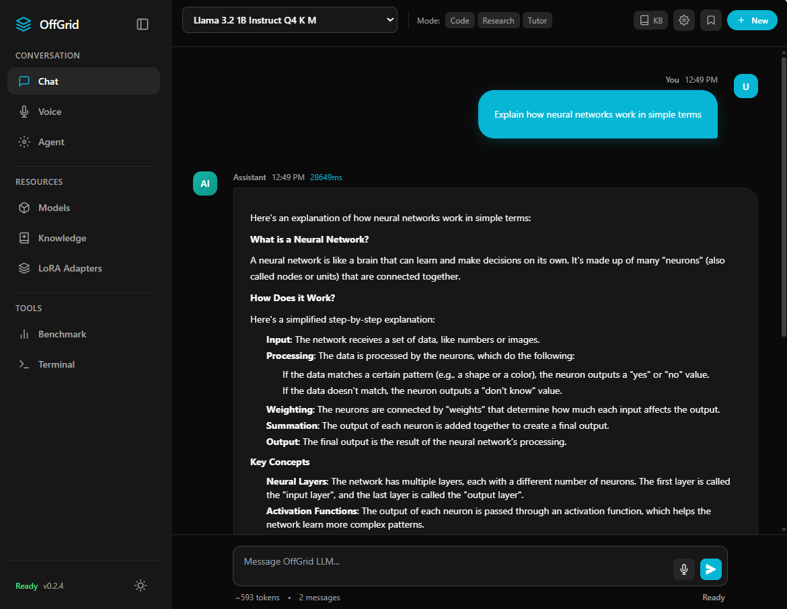
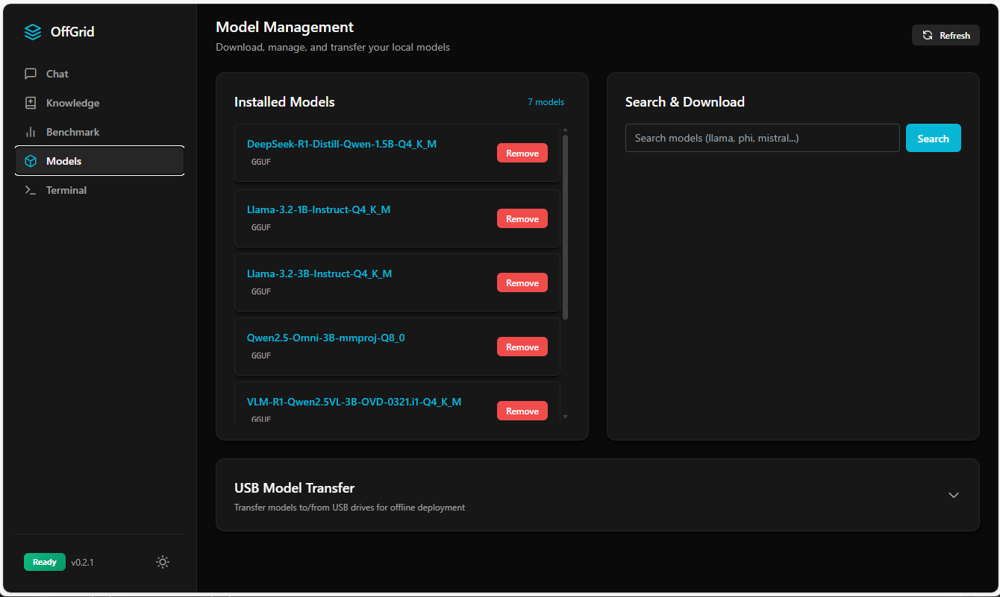

# OffGrid LLM

**Run powerful AI models completely offline on your own computer.**

[](LICENSE)
[](https://github.com/takuphilchan/offgrid-llm/releases)
[](https://github.com/takuphilchan/offgrid-llm/releases)
[](https://pypi.org/project/offgrid/)

No cloud. No subscriptions. No data leaving your machine.

<p align="center">
  
</p>

---

## Features

### Core
- **100% Offline** - Your data never leaves your computer
- **Modern Chat UI** - Clean, responsive web interface with session management
- **Cross-Platform** - Linux, macOS, and Windows support

### AI Capabilities
- **Voice Assistant** - Multi-language speech-to-text and text-to-speech (18+ languages)
- **Knowledge Base (RAG)** - Chat with your documents using embeddings
- **AI Agent** - Autonomous task execution with tool use
- **LoRA Fine-tuning** - Load custom adapters for specialized models

### Developer Tools
- **Python Library** - Simple API for scripting and automation
- **REST API** - OpenAI-compatible endpoints
- **Benchmark Suite** - Compare model performance
- **Built-in Terminal** - Run commands from the web UI

### Management
- **Model Hub** - Search and download from HuggingFace
- **User Management** - Multi-user support with API keys
- **Metrics Dashboard** - Server statistics and resource monitoring
- **USB Transfer** - Move models between air-gapped systems

---

## Install

### Quick Install (Non-Interactive)

Installs everything automatically - CLI, Desktop App, and Voice Assistant:

```bash
curl -fsSL https://raw.githubusercontent.com/takuphilchan/offgrid-llm/main/install.sh | bash
```

> **Note:** When piped through `curl`, the installer runs in non-interactive mode and installs the full system automatically. This is ideal for quick setup.

### Interactive Install (Choose Components)

Download first, then run to get a menu:

```bash
curl -fsSL https://raw.githubusercontent.com/takuphilchan/offgrid-llm/main/install.sh -o install.sh
bash install.sh
```

This shows an interactive menu:
```
What would you like to install?
  1) Full System      CLI + Desktop + Audio (recommended)
  2) CLI Only         Command-line tools only
  3) CLI + Audio      CLI with voice features
  4) CLI + Desktop    CLI with desktop app
```

### Environment Variable Options

```bash
# Custom configurations (pipe or interactive)
DESKTOP=no bash install.sh          # Skip desktop app
AUDIO=no bash install.sh            # Skip voice features
CLI=yes DESKTOP=no AUDIO=yes bash install.sh  # CLI + Audio only
```

**Start the server:**
```bash
offgrid serve
```

**Then open:** http://localhost:11611

### Python Library

```bash
pip install offgrid
```

---

## Screenshots

<table>
  <tr>
    <td align="center">
      
      <br/>
      <b>Chat Interface</b>
    </td>
    <td align="center">
      
      <br/>
      <b>Model Management</b>
    </td>
  </tr>
</table>

---

## Quick Start

```bash
# Install
curl -fsSL https://raw.githubusercontent.com/takuphilchan/offgrid-llm/main/install.sh | bash

# Start server
offgrid serve

# Open browser
# http://localhost:11611
```

---

## Usage

```python
import offgrid

# Connect to server
client = offgrid.Client()  # localhost:11611

# Or custom server
client = offgrid.Client(host="http://192.168.1.100:11611")

# Chat
response = client.chat("Hello!")
print(response)

# Specify model
response = client.chat("Hello!", model="Llama-3.2-3B-Instruct")

# Streaming
for chunk in client.chat("Tell me a story", stream=True):
    print(chunk, end="", flush=True)

# With options
response = client.chat(
    "Explain quantum computing",
    model="Llama-3.2-3B-Instruct",
    system="You are a physics teacher",
    temperature=0.7,
    max_tokens=500
)
```

### Model Management

```python
# List models
for model in client.list_models():
    print(model["id"])

# Search HuggingFace
results = client.models.search("llama", ram=8)

# Download
client.models.download(
    "bartowski/Llama-3.2-3B-Instruct-GGUF",
    "Llama-3.2-3B-Instruct-Q4_K_M.gguf"
)

# Import/Export USB
client.models.import_usb("/media/usb")
client.models.export_usb("model-name", "/media/usb")
```

### Knowledge Base (RAG)

```python
# Add documents
client.kb.add("notes.txt")
client.kb.add("meeting", content="Meeting notes...")
client.kb.add_directory("./docs")

# Chat with context
response = client.chat("Summarize the meeting", use_kb=True)

# Search documents
results = client.kb.search("deadline")
```

### Embeddings

```python
embedding = client.embed("Hello world")
embeddings = client.embed(["Hello", "World"])
```

### Voice Assistant

```python
# Speech-to-text (transcribe audio)
text = client.audio.transcribe("recording.wav")
print(text["text"])

# With language hint
text = client.audio.transcribe("spanish.wav", language="es")

# Text-to-speech (generate audio)
audio = client.audio.speak("Hello world!", voice="en_US-amy-medium")
with open("hello.wav", "wb") as f:
    f.write(audio)

# List available voices & models
voices = client.audio.voices()
models = client.audio.whisper_models()
```

**CLI:**
```bash
offgrid audio transcribe recording.wav           # Transcribe audio
offgrid audio speak "Hello!" -o greeting.wav     # Generate speech
offgrid audio voices                              # List voices
```

---

## Web UI & CLI

**Web Interface:** `http://localhost:11611`

The web UI includes:
- **Chat** - Conversation interface with session history
- **Voice** - Voice assistant with push-to-talk
- **Agent** - Autonomous AI task execution
- **Models** - Browse, download, and manage models
- **Knowledge** - RAG document management and embeddings
- **LoRA** - Load fine-tuned adapters
- **Benchmark** - Compare model performance
- **Terminal** - Run commands from browser
- **Users** - Manage users and API keys
- **Metrics** - Server statistics and monitoring

**Command Line:**
```bash
offgrid list                    # List models
offgrid search llama --ram 8    # Search HuggingFace
offgrid download-hf repo --file model.gguf
offgrid run model-name          # Interactive chat
offgrid serve                   # Start server
offgrid audio transcribe file.wav  # Transcribe audio
offgrid audio speak "Hello!"       # Text to speech
```

---

## System Requirements

| RAM | Models |
|-----|--------|
| 4GB | 1B-3B parameters |
| 8GB | 7B parameters |
| 16GB+ | 13B+ parameters |

GPU optional. Supports NVIDIA (CUDA), AMD (ROCm), Apple Silicon (Metal), Vulkan.

---

## Troubleshooting

| Issue | Solution |
|-------|----------|
| FUSE error on Linux | `sudo apt install libfuse2` or reinstall (auto-extracts) |
| Voice features not working | `rm -rf ~/.offgrid-llm/audio && offgrid audio setup whisper` |
| GLIBC compatibility | Installer auto-detects and offers build-from-source option |

For detailed troubleshooting, see [docs/INSTALLATION.md](docs/INSTALLATION.md).

---

## Documentation

| Guide | Description |
|-------|-------------|
| [Quick Start](docs/QUICKSTART.md) | Get running in 5 minutes |
| [Python Library](python/README.md) | Full Python API reference |
| [CLI Reference](docs/CLI_REFERENCE.md) | All commands |
| [API Reference](docs/API.md) | REST API endpoints |
| [Embeddings Guide](docs/guides/EMBEDDINGS_GUIDE.md) | RAG and document embeddings |
| [HuggingFace Integration](docs/guides/HUGGINGFACE_INTEGRATION.md) | Model search and download |

**Docker:** [docs/DOCKER.md](docs/DOCKER.md) · **Contributing:** [dev/CONTRIBUTING.md](dev/CONTRIBUTING.md)

---

## License

MIT License - [LICENSE](LICENSE)

**Built with [llama.cpp](https://github.com/ggerganov/llama.cpp)**
